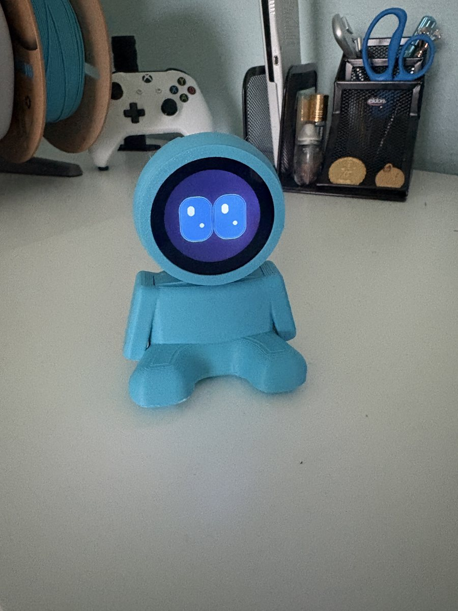
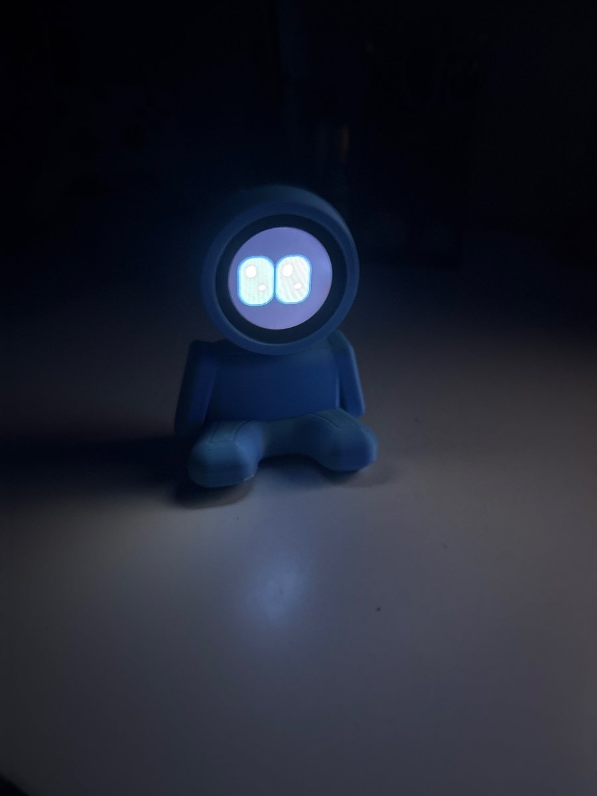
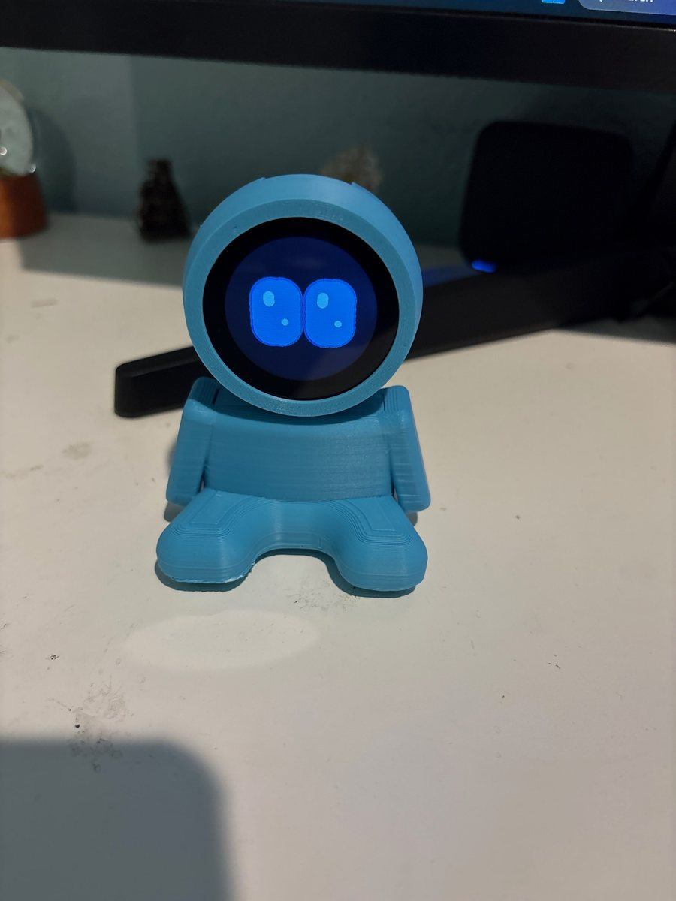
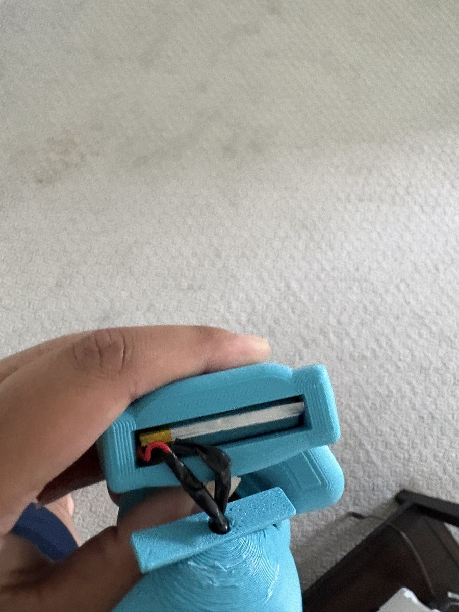
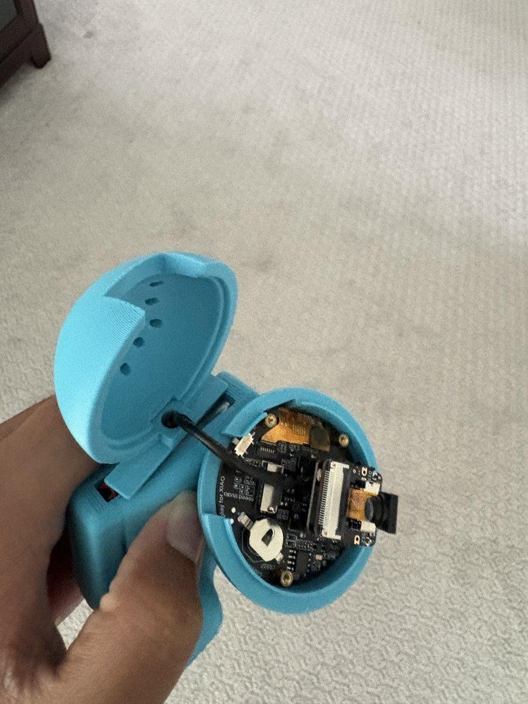

# Ares

A desk robot companion with two big, glowing ocean-blue eyes on a round screen.
Ares listens through its onboard microphone, thinks on your PC with **Gemini Live**,
and speaks back through your computer speakers — while its eyes animate idle,
listening, and speaking states.


---

## Quick Start

1. **Flash the firmware** — see [Docs/flashing.md](Docs/flashing.md).
2. **Install the desktop app** — see [Desktop/README.md](Desktop/README.md).
3. Put the robot on WiFi (USB provisioning in the app), connect by IP, paste your
   Gemini API key, and click **Start talking**.

You can also open `http://<robot-ip>/` on your phone — the ESP32 serves a web UI
that uses the robot mic and drives the eyes.

---

## Features

- **Animated robot eyes** — blink, gaze, breathe; states for idle / listening / speaking
- **Onboard PDM mic** streamed over WiFi to the desktop app (or phone web UI)
- **Gemini Live voice assistant** on your PC with web search and safe PC control tools
- **Hands-free wake word** — say "Ares" (local Vosk, no signup)
- **Swipe-down menu** on the round display — brightness slider + robot IP
- **Personality files** — edit `system.md` and `memory.md`; synced to the robot over WiFi
- **System-tray agent** — optional background auto-connect + hands-free mode
- **Camera-ready hardware path** — the ESP32-S3 Sense camera is not integrated in
  this build because the stock ribbon cable is too short for the enclosure layout

---

## Architecture

```
ESP32 mic --(WiFi TCP :8080)-->  Desktop app  -->  Gemini Live
ESP32 eyes <--(state JSON)-------               |
                                                +--> PC speakers
Phone browser --(WebSocket :81)--> robot-served page + Gemini
```

See [Docs/architecture.md](Docs/architecture.md) for ports, pins, and design notes.

---

## What is this?

Ares is a small desk character you can talk to. The ESP32-S3 + round display handles
the face, touch, and microphone. Your PC runs the voice AI (Gemini), plays audio, and
can open apps, search the web, and remember shortcuts on your behalf.

---

## Hardware

| Part | Role |
|------|------|
| Seeed XIAO ESP32-S3 **Sense** | MCU + onboard PDM microphone |
| Seeed Round Display for XIAO | GC9A01 240x240 round IPS + touch |
| MakerHawk 1000mAh 1S LiPo | Battery power |
| Custom 3D-printed enclosure | Printable files in [CAD/](CAD/) |

Full enclosure files and build notes: [CAD/](CAD/).

### Camera note

The Seeed XIAO ESP32-S3 Sense includes a camera connector/camera module, but Ares
does not currently use it. The stock camera ribbon cable is too short for this
enclosure, so the camera is not routed through the top cutout.

A future build could swap in a compatible camera module or longer ribbon cable,
route it through the top cutout, and extend the firmware/desktop bridge to send
camera frames into Gemini Live for visual analysis with `gemini-3.1-flash-live-preview`.
That would require code changes; the current release is voice-first.

---

## Repo layout

| Folder | Contents |
|--------|----------|
| [Firmware/](Firmware/) | Arduino sketch for the ESP32 (`RobotEyes.ino`) |
| [Desktop/](Desktop/) | Python companion app (Gemini Live, wake word, tray agent) |
| [Docs/](Docs/) | Flashing, architecture, setup |
| [CAD/](CAD/) | STEP assembly and printable enclosure STLs |

---

## Photos

| Ares on the desk | Low-light glow |
|---|---|
|  |  |

| Front view | Battery slot | Internal electronics |
|---|---|---|
|  |  |  |

---

## Credits

Built as a desk companion project. README structure inspired by my macropad repo
[HandyPad](https://github.com/nilaynagh8-del/HandyPad), which was modeled after
[Logan Peterson's SplashPad](https://github.com/SharKingStudios/SplashPad).

Uses [Gemini Live](https://ai.google.dev/), [Vosk](https://alphacephei.com/vosk/),
and Seeed Studio hardware.

---

## Disclaimer

This project is open source. If anything you build from this does not work or has
any issues, I sincerely apologize, but at the end of the day **that's on you.**

Gemini Live requires a Google AI Studio API key with billing enabled for realtime
voice. See [Desktop/README.md](Desktop/README.md) for setup.
